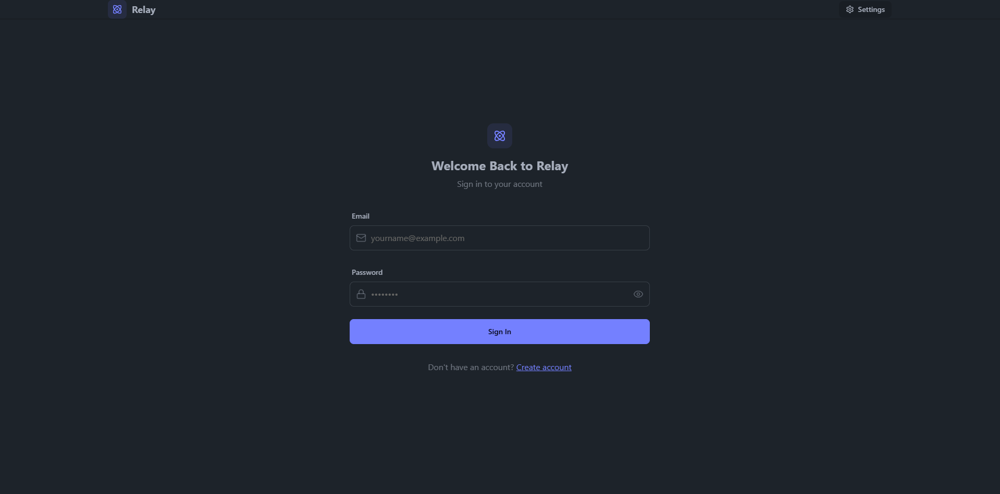
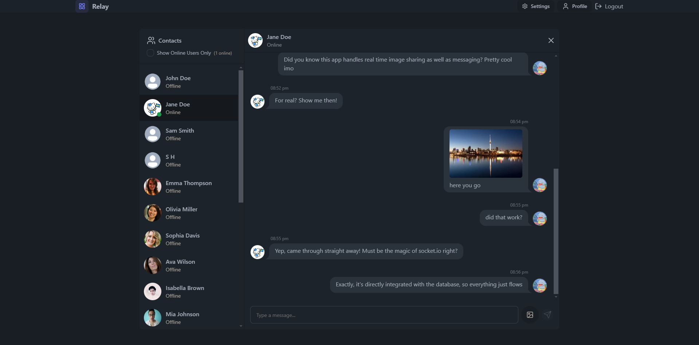
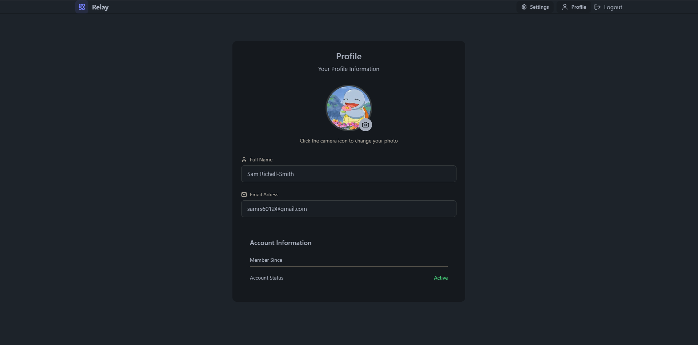
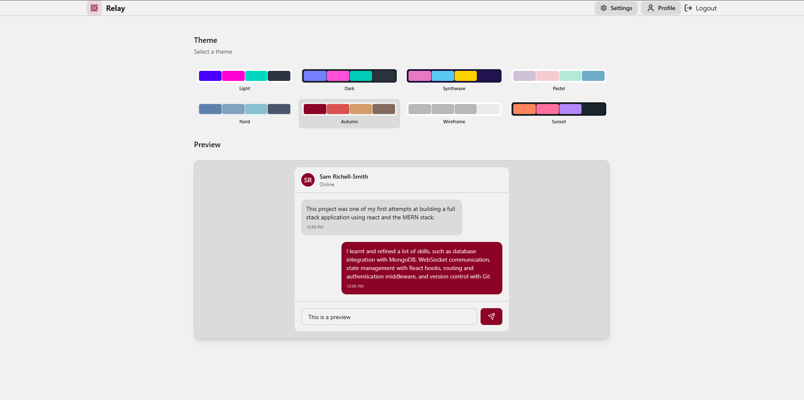
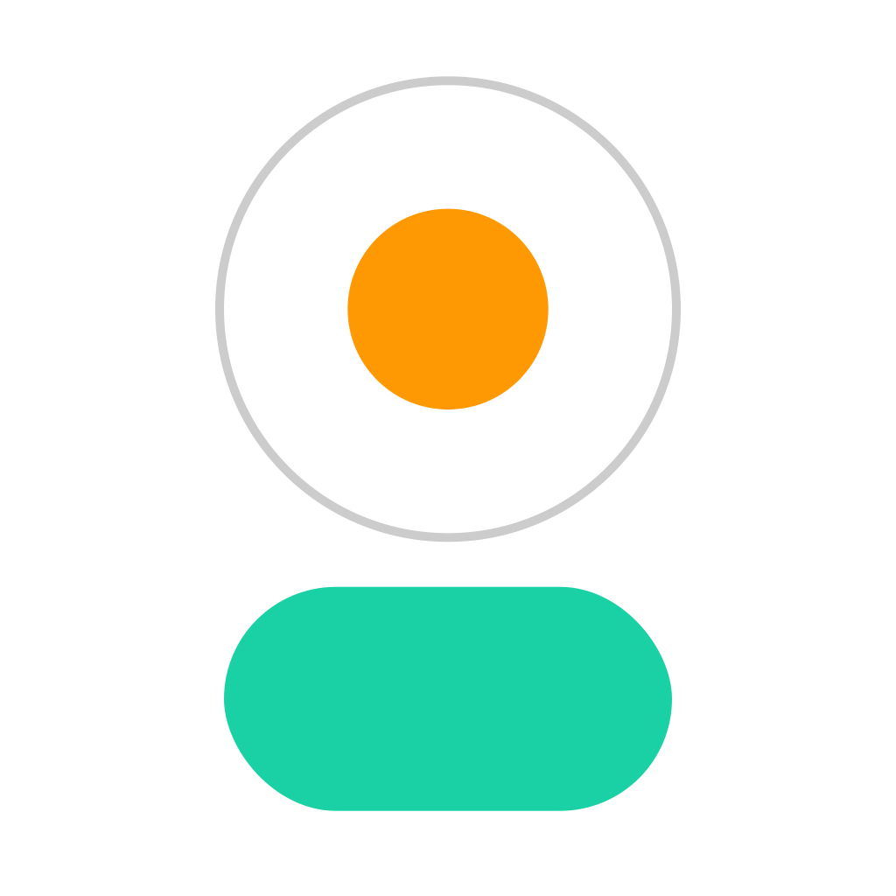

<h1>Real-Time Messaging App </h1>

This <strong>Real-Time Messaging App</strong> called <strong>Relay</strong> is developed using the <strong>MERN stack</strong> (MongoDB, Express.js, React, Node.js), enabling seamless real-time communication between users. I built this project not only to create a functional messaging app, but also to challenge myself and deepen my understanding of full-stack development. I learnt a lot about real-time data handling with <strong>Socket.io</strong>, as well as how to implement robust user authentication, and create a dynamic user interface using <strong>React</strong> and <strong>Tailwind CSS</strong>. This experience allowed me to build and grow my problem-solving skills, and gain experience with the design and architecture of real world web applications.

<h2>Live Demo</h2>

Experience the app live at <a href="https://relay-bp3t.onrender.com" target="_blank">this link</a>. Login with email: demoUser@email.com and password: 123456 Feel free to test its features and functionality. (It may take some time to launch due to hosting).

<h2>Key Features & Technologies</h2>

<h3>User Authentication</h3>

Secure login and signup functionality is implemented using <strong>JWT</strong> and <strong>bcrypt</strong> with Express.js, ensuring that user data is protected and accessible only to authorized users.

<h3>Real-Time Messaging</h3>

Utilizing <strong>Socket.io</strong>, users can send and receive messages instantly, enhancing their experience with real-time interactions.
 

<h3>Dynamic User Interface</h3>

The frontend is designed with <strong>React</strong> and <strong>Tailwind CSS</strong>, incorporating <strong>DaisyUI</strong> components for a responsive and visually appealing interface.

<h3>Media Sharing</h3>

Users can share text messages and images in real time, showcasing a seamless multimedia communication experience.

<h3>User Status Display</h3>

Real-time online status indicators are integrated, allowing users to see who is available for chat, implemented using <strong>Socket.io</strong> for efficient data handling.

<h3>Profile Management</h3>

A user profile page allows users to update their information and change profile pictures.

<h3>Theme Customization</h3>

A settings page enables users to choose from a range of pre-set themes using <strong>DaisyUI</strong>, providing flexibility and customization in design.

<h2>Technologies Used</h2>
<ul>
    <li><strong>Frontend:</strong>
        <ul>
            <li><strong>React:</strong> For building interactive user interfaces.  </li> 
            <li><strong>Tailwind CSS:</strong> For styling with utility-first CSS. </li>
            <li><strong>DaisyUI:</strong> To provide pre-designed UI components for faster development. </li>
        </ul>
    </li>
    <li><strong>Backend:</strong>
        <ul>
            <li><strong>Node.js:</strong> For server-side JavaScript execution. </li>
            <li><strong>Express.js:</strong> To create robust RESTful APIs. </li>
            <li><strong>Socket.io:</strong> For enabling real-time bidirectional communication. </li>
        </ul>
    </li>
    <li><strong>Database:</strong>
        <ul>
            <li><strong>MongoDB:</strong> For storing user data and chat messages efficiently. </li>
        </ul>
    </li>
    <li><strong>Deployment:</strong>
        <ul>
            <li><strong>Render.com:</strong> For hosting the live demo

